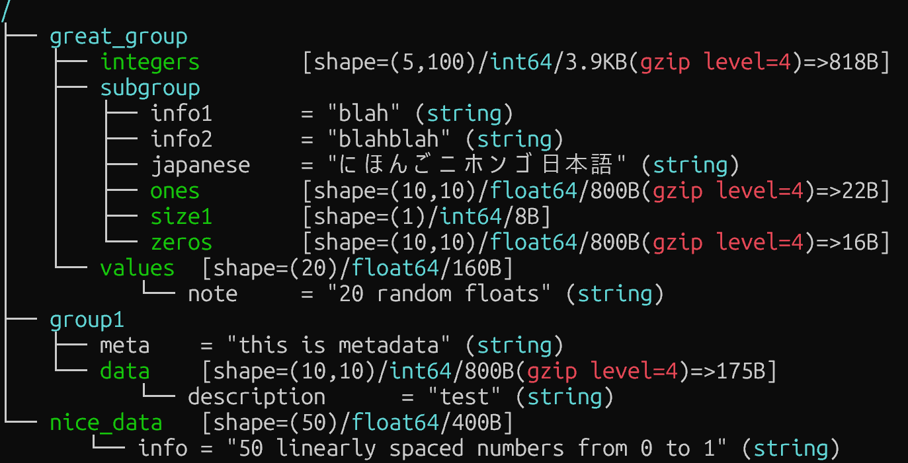

## h5tree

### Summary
h5tree displays the hierarchy of an HDF5 file in a tree view.


### Installation
Move to `h5tree` directory.
Then,
```bash
make
sudo make install
```

### Usage
```bash
h5tree <Path to HDF5 file>
```

**Options**
- `-s` or `--structure-only`: display only hierarchical structure of the file.
- `-j` or `--json`: output in JSON format.
- `--version`: display version information.

### Example
#### default
```bash
>> h5tree sample.h5
```



#### -s option
```bash
>> h5tree sample.h5 -s
/
├── great_group
│   ├── integers
│   ├── subgroup
│   │   ├── info1
│   │   ├── info2
│   │   ├── japanese
│   │   ├── ones
│   │   ├── size1
│   │   └── zeros
│   └── values
│          └── note
├── group1
│   ├── meta
│   └── data
│          └── description
└── nice_data
       └── info
```

#### -j option
```json
>> h5tree sample.h5 -j

{
  "/": {
    "children": {
      "great_group": {
        "children": {
          "integers": {
            "dtype": "int64",
            "shape": [5, 100],
            "logical_size": 4000,
            "storage_size": 818
          },
          "subgroup": {
            "attributes": {
              "info1": "blah",
              "info2": "blahblah",
              "japanese": "にほんごニホンゴ日本語"
            },
            "children": {
              "ones": {
                "dtype": "float64",
                "shape": [10, 10],
                "logical_size": 800,
                "storage_size": 22
              },
              "size1": {
                "dtype": "int64",
                "shape": [1],
                "logical_size": 8,
                "storage_size": 8
              },
              "zeros": {
                "dtype": "float64",
                "shape": [10, 10],
                "logical_size": 800,
                "storage_size": 16
              }
            }},
          "values": {
            "dtype": "float64",
            "shape": [20],
            "logical_size": 160,
            "storage_size": 160,
            "attributes": {
              "note": "20 random floats"
            }
          }
        }},
      "group1": {
        "attributes": {
          "meta": "this is metadata"
        },
        "children": {
          "data": {
            "dtype": "int64",
            "shape": [10, 10],
            "logical_size": 800,
            "storage_size": 175,
            "attributes": {
              "description": "test"
            }
          }
        }},
      "nice_data": {
        "dtype": "float64",
        "shape": [50],
        "logical_size": 400,
        "storage_size": 400,
        "attributes": {
          "info": "50 linearly spaced numbers from 0 to 1"
        }
      }
    }}
}
```